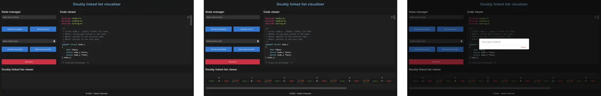

# Web - Doubly linked list visualizer

## 🔖 Table of contents

<details>
        <summary>
        CLICK TO ENLARGE 😇
        </summary>
        📄 <a href="#description">Description</a>
        <br>
        🎓 <a href="#objectives">Objectives</a>
        <br>
        🔨 <a href="#tech-stack">Tech stack</a>
        <br>
        📂 <a href="#files-description">Files description</a>
        <br>
        💻 <a href="#installation_and_how_to_use">Installation and how to use</a>
        <br>
        🔧 <a href="#whats-next">What's next ?</a>
        <br>
        ♥️ <a href="#thanks">Thanks</a>
        <br>
        👷 <a href="#authors">Authors</a>
</details>

## 📄 <span id="description">Description</span>

This project is an interactive web application designed to help beginners learn about doubly linked lists in C. It allows users to create, manipulate, and visualize the structure of a doubly linked list, while simultaneously generating corresponding C code.

By interacting with the application, users can:

- Add nodes at the beginning, end, or a specific position.
- Delete nodes from any position.
- View the doubly linked list's structure and its node connections.
- See the generated C code for the list in real-time.
- Copy the generated C code to create a `.c` file, compile it, and execute it in the terminal to visualize the list's structure.

This tool is particularly aimed at students learning C, to reinforce their understanding of memory allocation, pointers, and linked data structures. The ability to compile and execute the code directly in a terminal ensures a hands-on learning experience.

## 🎓 <span id="objectives">Objectives</span>

The primary goals of this project are to:

- Demystify doubly linked lists: help students understand how they work through visualization (like with a whiteboard).
- Bridge theory and practice: connect abstract concepts to hands-on C programming.
- Generate educational C code: display live C code that reflects the current state of the list.
- Encourage experimentation: allow users to test generated code by compiling and running it in their terminal.

## 🔨 <span id="tech-stack">Tech stack</span>

<p align="left">
    
    
    
    
    
</p>

## 📂 <span id="files-description">File description</span>

| **FILE**       | **DESCRIPTION**                                     |
| :------------: | --------------------------------------------------- |
| `assets`       | Contains the resources required for the repository. |
| `README.md`    | The readme file you are currently reading 😉.       |
| `behaviors.js` | JavaScript file managing all interactive behaviors. |
| `index.html`   | The main HTML structure of the web application.     |
| `styles.css`   | CSS file for styling the application.               |

## 💻 <span id="installation_and_how_to_use">Installation and how to use</span>

**Installation:**

1. Clone this repository:
    - Open your preferred Terminal.
    - Navigate to the directory where you want to clone the repository.
    - Run the following command:

```
git clone https://github.com/fchavonet/web-doubly_linked_list_visualizer.git
```

2. Open the repository you've just cloned.

3. Open `index.html` in your browser.

**How to use:**

1. Use the Node Manager section to:
    - Add a node at the beginning, end, or a specific position in the list.
    - Delete a node from a specific position.
    - Reset the entire list.

2. Observe the Code Viewer section:
    - The C code corresponding to the current state of your doubly linked list is generated in real-time.

3. Copy the generated C code:
    - Click the Copy Code button to copy the C code to your clipboard.

    4. Create and compile the code:
    - Save the copied code into a `.c` file, for example:

    ```shell    
    vim doubly_linked_list.c
    ```

    - Paste the code, save the file, and exit.
    - Compile the program:

    ```shell
    gcc doubly_linked_list.c -o doubly_linked_list
    ```

5. Run the compiled program:
    - Execute the program in your terminal:

    ```shell
    ./doubly_linked_list
    ```

6. Visualize the list in the terminal:
    - The program will display the structure of the doubly linked list, showing each node's data and its connections (prev and next).

You can also test the web application by clicking [here](https://fchavonet.github.io/web-doubly_linked_list_visualizer/).

<p align="center">
    
</p>

## 🔧 <span id="whats-next">What's next ?</span>

- Enabling more advanced operations (reversing the list, searching for values...).
- Introducing animations to show step-by-step changes in the list structure.

## ♥️ <span id="thanks">Thanks</span>

- A big thank you to my friends Pierre and Yoann for taking time out of their busy schedule to test this web application.

## 👷 <span id="authors">Authors</span>

**Fabien CHAVONET**
- Github: [@fchavonet](https://github.com/fchavonet)
