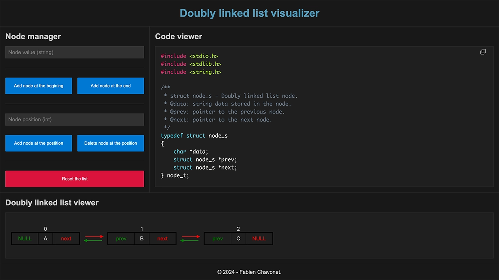

# Doubly Linked List Visualizer

## Description

This project is an interactive web application designed to help beginners understand how doubly linked lists work in C. It allows users to create, manipulate, and visualize the structure of a doubly linked list, while simultaneously generating corresponding C code.

Using the application, users can:

- Add nodes at the beginning, end, or a specific position.
- Delete nodes from any position.
- View the doubly linked list's structure and its node connections.
- See the generated C code for the list in real-time.
- Copy the generated C code to create a `.c` file, compile it, and execute it in the terminal to visualize the list's structure.

This tool is particularly aimed at students learning C, to reinforce their understanding of memory allocation, pointers, and linked data structures. The ability to compile and execute the code directly in a terminal ensures a hands-on learning experience.

## Objectives

- Help students understand how doubly linked lists work through visualization (as if on a whiteboard).
- Connect abstract concepts to hands-on C programming.
- Display live C code that reflects the current state of the list.
- Allow users to test generated code by compiling and running it in their terminal.

## Tech Stack


## File Description

| **FILE**     | **DESCRIPTION**                                     |
| :----------: | --------------------------------------------------- |
| `assets`     | Contains the resources required for the repository. |
| `index.html` | Main HTML structure for the project.                |
| `style.css`  | Styles and animations for the project.              |
| `script.js`  | Behavior script for interactivity.                  |
| `README.md`  | The README file you are currently reading 😉.       |

## Installation & Usage

### Installation

1. Clone this repository:
    - Open your preferred Terminal.
    - Navigate to the directory where you want to clone the repository.
    - Run the following command:

```
git clone https://github.com/fchavonet/full_stack-doubly_linked_list_visualizer.git
```

2. Open the cloned repository.

### Usage

1. Open the `index.html` file in your web browser.

2. Use the Node Manager section to:
    - Add a node at the beginning, end, or a specific position in the list.
    - Delete a node from a specific position.
    - Reset the entire list.

2. Observe the Code Viewer section:
    - The C code corresponding to the current state of your doubly linked list is generated in real-time.

3. Copy the generated C code:
    - Click the Copy Code button to copy the C code to your clipboard.

4. Create and compile the code:
    - Save the copied code into a `.c` file, for example:

    ```  
    vim doubly_linked_list.c
    ```

> You can use any text editor instead of Vim, if you prefer.

    - Paste the code, save the file, and exit.
    - Compile the program:

    ```
    gcc doubly_linked_list.c -o doubly_linked_list
    ```

5. Run the compiled program:
    - Execute the program in your terminal:

    ```
    ./doubly_linked_list
    ```

6. Visualize the list in the terminal:
    - The program will display the structure of the doubly linked list, showing each node's data and its connections (prev and next).

You can also test the project online by clicking [here](https://fchavonet.github.io/full_stack-doubly_linked_list_visualizer/). 

<p align="center">
    
</p>

## What's Next?

- Enabling more advanced operations (reversing the list, searching for values...).
- Introducing animations to show step-by-step changes in the list structure.

## Thanks

- A big thank you to my friends Pierre and Yoann, always available to test and provide feedback on my projects.

## Author(s)

**Fabien CHAVONET**
- GitHub: [@fchavonet](https://github.com/fchavonet)
